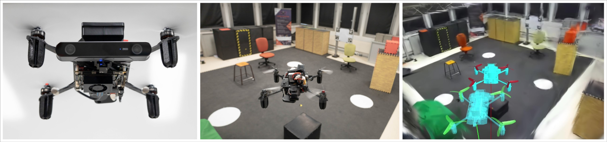

# Real-time Photorealistic Mapping for Situational Awareness in Robot Teleoperation

### [Video](https://www.youtube.com/watch?v=-Md49rKkV8I) | Paper coming soon

**Ian Page<sup>1</sup>, Pierre Susbielle<sup>1</sup>, Olivier Aycard<sup>1</sup> and Pierre-Brice Wieber<sup>2</sup>**
GIPSA-lab <sup>1</sup>
INRIA <sup>2</sup>



## Introduction

This project efficiently combines a Gaussian Splatting SLAM algorithm (CaRtGS), and an interactive viewer (Clarte GS VR Unity viewer) to enable real-time photorealistic map-based robot teleoperation.

## Prerequisits

### Docker

Due to the complexity and numerous dependencies of both systems, this project uses two Docker containers, one for each component, referred to as gsslam_backend and interactive_viewer. Use the provided Dockerfiles and build scripts to build the project in another environment.

### Installation
1. Clone the repository with all submodules:
```bash
git clone --recurse-submodules https://github.com/ian-pge/GS_SLAM_teleoperation.git
```

2. Check Docker Compose configuration in the docker-compose.yaml file:
  - Ensure the NVIDIA runtime flags are correctly set for your system
  - Verify all volume paths are correctly mapped between host and containers
  - Check that X11 forwarding is properly configured, for GUI applications inside docker to work properly

3. If you don't have a personal Unity license, create one by installing [Unity Hub](https://docs.unity3d.com/hub/manual/InstallHub.html), then copy your [Unity license file](https://docs.unity3d.com/6000.2/Documentation/Manual/ActivationFAQ.html) to interactive_viewer/
```bash
cp ~/.local/share/unity3d/Unity/Unity_lic.ulf GS_SLAM_teleoperation/interactive_viewer/
```

4. Build and attach to the 2 Docker containers:
```bash
cd GS_SLAM_teleoperation &&
docker compose up
```
```bash
docker exec -it gsslam_backend bash
```
```bash
docker exec -it interactive_viewer bash
```

5. Build project inside the gsslam_backend container

Configure ZED ros2 wrapper in gsslam_backend/ros2_ws/src/zed-ros2-wrapper/zed_wrapper/config/common_stereo.yaml
  - pub_resolution: "NATIVE"
  - pub_frame_rate: 30.0
  - depth mode : "NEURAL"
  - area_file_path : ""

```bash
cd /workspace/gsslam_backend &&
./post_create.sh
```

6. Build project and activate Unity license inside the interactive_viewer container
```bash
cd /workspace/interactive_viewer &&
./post_create.sh
```
```bash
unity-editor -manualLicenseFile /workspace/interactive_viewer/Unity_lic.ulf -logFile /dev/stdout
```

## Usage


2. Run interactive_viewer code
```bash
cd /workspace/interactive_viewer &&
/opt/unity/Editor/Unity -projectPath /workspace/interactive_viewer/UnityProject
```

3. Run gsslam_backend code
```bash
source /home/zed/.bashrc && cd /workspace/gsslam_backend &&
ros2 launch orb_slam3_ros2_wrapper run_scanning.py
```

4. Select the GaussianSplatting scene in the scene folder and click play on Unity

## Acknowledgement
This work incorporates many open-source codes. We extend our gratitude to the authors of the software.
- [CaRtGS](https://github.com/DapengFeng/cartgs/blob/main/README.md)
- [Clarte GS VR Unity viewer](https://github.com/clarte53/GaussianSplattingVRViewerUnity)
- [Gaussian Splatting](https://github.com/graphdeco-inria/gaussian-splatting)

## Citation
If you find this work useful in your research, consider citing it:
```
Coming soon
```
